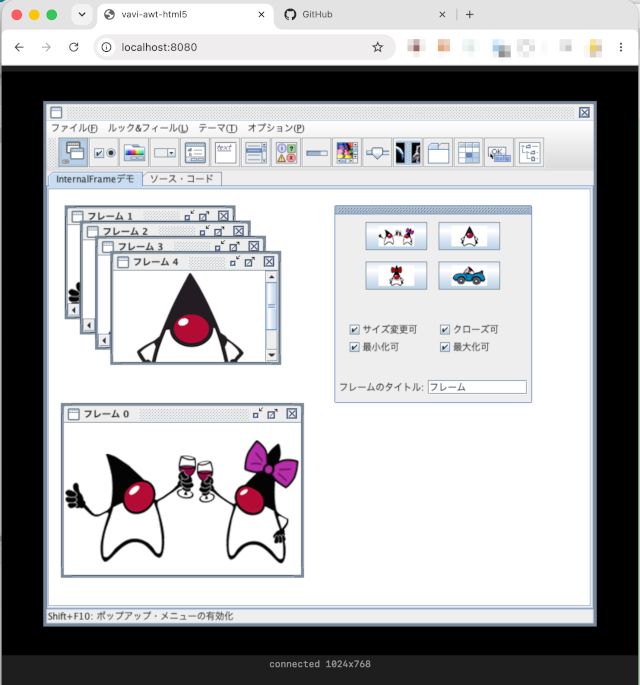

[](https://jitpack.io/#umjammer/vavi-awt-html5)
[](https://github.com/umjammer/vavi-awt-html5/actions/workflows/maven.yml)
[](https://github.com/umjammer/vavi-awt-html5/actions/workflows/codeql.yml)


# vavi-awt-html5

 &nbsp;&nbsp; SwingSet2.jar on a browser.

Runs an unmodified AWT/Swing application on a JVM and mirrors its UI to a
browser: an HTML5 toolkit backend renders into an off-screen framebuffer, ships
changed regions as PNG tiles over a binary protocol, and a WebAssembly client
(Java compiled with TeaVM) paints them to a `<canvas>` and forwards input.
`javax.sound` playback is captured by a mixer backend and played in the
browser through Web Audio (a click on the page is needed once — browser
autoplay policy).

```
awt/swing → Html5Toolkit (cacio-shared) → framebuffer → binary protocol
          → WebSocket / WebTransport → TeaVM wasm canvas renderer
```

See [docs/design.md](docs/design.md) for the architecture and the transport
notes (WebSocket is the working default; WebTransport is present but blocked by
a browser/library draft mismatch).

## Install

* [maven](https://jitpack.io/#umjammer/vavi-awt-html5)

## Usage

```shell
$ mvn package
$ bin/run.sh                       # the bundled demo app
$ bin/run.sh com.example.YourApp   # any Swing app on the classpath
$ bin/run.sh YourApp.jar           # any Swing app in the jar
# then open http://localhost:8080/
```

### system properties

- `cacio.managed.screensize` ... default `1024x768`

## References

 * https://github.com/CaciocavalloSilano/caciocavallo
 * https://github.com/ptrd/flupke (WebTransport over HTTP/3)
 * https://teavm.org (Java → WebAssembly)
 * https://github.com/rigd-loxia/gwtx-g2d

## TODO

 * ~~frame bar DnD~~
 * ~~swingset2~~
 * logging
 * ~~sound~~
 * microphone capture (browser → `TargetDataLine`)
